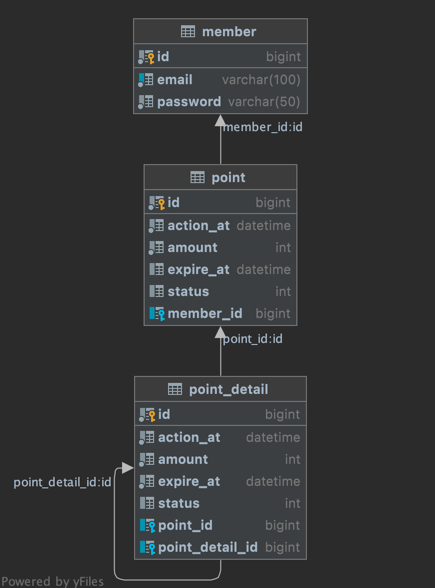

# 0. prerequisite
```
# jdk8 버전이 필요합니다.
# JAVA_HOME 및 PATH 환경변수가 설정되어있어야합니다.

$ sudo apt update
$ sudo apt install openjdk-8-jdk

$ java -version
```

# 1. install
```
~ $ git clone https://github.com/kys6879/point-api.git
~ $ cd point-api
```

# 2. Build
```
~/point-api $  ./build.sh
```

# 3. Run
```
~/point-api $  ./run.sh
```

# 4. API

|Root Context|설명|
|------|---|
|/members/{회원번호}|회원번호는 1로 고정


## 4.0 Models

### BaseResponse
```
{
    "success": true, // 성공 실패 여부
    "code": "OK", // 성공시 "OK", 에러시 에러코드 전달
    "data": T // 도메인 응답 모델
}
```


## 4.1 적립 및 사용 이력 조회

```
GET /members/1/points?page=0&size=30&direction=DESC
```

|파라미터|타입|설명|
|------|---|---|
|page|Integer|필수. 몇번째 페이지인지. 0부터 시작합니다.|
|size|Integer|필수. 몇개의 이력들을 가져올건지|
|direction|string|필수 . 등록순서를 기준으로 정렬해서 가져옵니다. ASC : 오름차순 DESC : 내림차순|

### Response


#### GetPointsResponse
```
{
    "points": [PointDto.model], // PointDto 모델
    "totalSize" : 1  // 총 페이지 수
}
```
#### PointDto

```
{
    "id": 5, // 고유번호
    "status": "EARN", // 적립 EARN, 사용 USED, 만료 EXPIRED
    "amount": 1000, // 포인트 금액
    "actionAt": "2022-01-05T23:10:00", // 처리시간
    "expireAt": "2023-01-05T23:10:00", // 만료시간
    "member": {
        "id": 1, // 고유번호
        "email": "apple@example.com", // 이메일 (fake)
        "password": "1234" // 비밀번호 (fake)
    }
},
```

## 4.2 포인트 합계 조회

```
GET /members/1/points/total
```
### Response


#### GetTotalPointResponse
```
{
    "totalPoint": 3500 // 포인트 합계
}
```

## 4.3 포인트 적립

```
POST /members/1/points/earn
```

|파라미터|타입|설명|
|------|---|---|
|amount|Integer|필수. 적립 할 포인트 금액|

```
Content-Type : application/json
{
    "amount": 100
}
```

### Response


#### GetPointResponse
```
{
    "point": PointDto.model, // PointDto 모델
}
```

## 4.4 포인트 사용

```
POST /members/1/points/use
```

|파라미터|타입|설명|
|------|---|---|
|amount|Integer|필수. 사용 할 포인트 금액|

```
Content-Type : application/json
{
    "amount": 100
}
```


### Response


#### GetPointResponse
```
{
    "point": UsedDto.model, // UsedDto 모델,
    
}
```

#### UsedDto

```
{
    "id": 9, // 고유번호
    "status": "USED", // 적립 EARN, 사용 USED, 만료 EXPIRED
    "amount": 3700, // 사용한 포인트 금액
    "actionAt": "2022-02-13T22:46:37.751", // 처리시간
    "expireAt": null, //  만료시간
    "member": {
        "id": 1, // 고유번호
        "email": "apple@example.com", // 이메일 (fake)
        "password": "1234" // 비밀번호 (fake)
    },
    details : [PointDetailDto] // PointDetailDto 모델. 사용한 3700원이 어떤 포인트를 사용했는지.
},
```

#### PointDetailDto

```
{
    "id": 3, // 고유번호
    "amount": 3000, // 포인트 금액
    "pointStatusEnum": "EARN", // 적립 EARN, 사용 USED, 만료 EXPIRED
    "actionAt": "2022-01-03T23:10:00" // 처리시간
},
```

## 4.5 포인트 만료

> 이 API는 event service에서 동작하는 내용을 REST-API로 구현합니다.
회원 별 포인트 이력을 참조해서 유효기간이 지난 포인트가 있다면 만료처리를 합니다.
실제 시스템에서는 Micro service로 분리되어 특정 주기마다 event처리를 하여 포인트를 만료시킵니다.

> 포인트를 적립할때의 시간은 서버시간을 기준으로하고, 만료시간은 적립할때의 시간의 1년 뒤 입니다.
> 따라서 포인트만료 API를 테스트해보기 위해서는 포인트의 timestamp를 과거로 수정해야합니다.

> H2 데이터베이스 쿼리를 사용하여 직접 timestamp를 조작해도되고, Unit 테스트코드를 작동시켜도 됩니다.

```
POST /members/1/points/expire
```

### Response


#### GetPointResponse
```
{
    "points": [PointDto.model], // PointDto 모델, 만료된 포인트. 
    // 3000원을 적립. 5000원을 적립. 4500원을 사용했을때
    // 적립한 5000원에 대해 유효기간(1년)이 지났으면 이는 만료대상으로 인식합니다. (차액 3500원은 사용하지 않았기 때문.)
}
```

# Intentions , Etc..

### Database ERD


* point 테이블은 회원에 대한 포인트 이력을 저장합니다.
* point_detail 테이블은 point에 대한 이력을 저장합니다.
* point_detail 테이블 자신의 pk를 외래키로 가지고 있습니다.
  * 이 모델로 먼저 적립된 포인트를 사용할 수 있습니다.
    * ( 사용 포인트가 insert 될때 적립 포인트를 연관관계로 설정 )
  * 또한 포인트의 합계 계산 로직이 최적화됩니다. 
    * ( group by절로 전액 사용된 포인트를 제외하고 sum 연산  )

### Mock-Data
* WAS 기동시 H2 DB가 실행되며 정의해둔 sql파일을 읽어 DDL을 실행시킵니다.
* src/main/resource/sql 경로에 SQL파일이 있습니다.
* init_data.sql 은 다음 시나리오를 가지고 있습니다.
  * 1000원 적립
  * 2000원 적립
  * 3000원 적립
  * 3300원 사용
    * 먼저 적립했던 포인트를 사용한 이력을 추가로 남깁니다.
  * 1000원 적립
  * [과거] 3000원 적립
  * [과거] 5000원 적립
  * [과거] 4500원 사용
    * 먼저 적립했던 포인트를 사용한 이력을 추가로 남깁니다.
  * 과거 데이터는 이미 유효기간이 만료된 시간을 지정합니다. (For test api.)

### ETC
* init_data.sql 에 의해 최초로 포인트 합계 API를 호출하면 3700원을 응답합니다. (1000 + 2000 + 3000 - 3300 + 1000)
  * 과거데이터는 만료되었으니 합계 계산 X
* Q) 만료 API를 호출하지 않았는데 왜 합계 계산이 안되나요?
  * A) 합계 계산시 유효기간 Timestamp을 비교하기 때문입니다. 
       만료 API를 호출하면 만료되었다는 이력이 기록됩니다. 
       이 기록을 쌓기 위해 만료 API를 호출합니다. 
